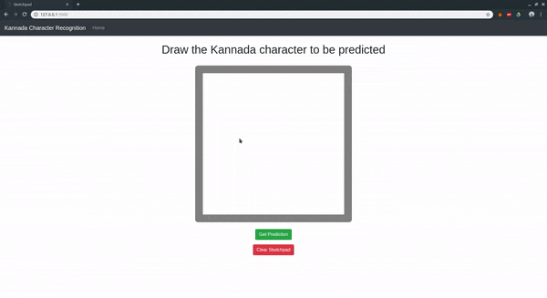

# Handwritten Kannada Character Recognition

This application predicts the handwritten Kannada character using a pretrainet ResNet18 model. You can use the basic web app to draw the character on a sketchpad and get the prediction.

## Demo



## Dataset

For this model, I have used the Kannada handwritten characters from the [Chars74k Dataset](http://www.ee.surrey.ac.uk/CVSSP/demos/chars74k/).

The dataset contains 657 classes and 25 images from each class(not a lot).

## Getting Started

## Code Requirements

**Highly recommend a NVIDIA GPU** in order to use this project, but will work on a CPU too. The program will run a lot slower when using CPU.

**This project only works on Linux.**(The fastai library only runs on Linux)

Recommend downloading all the below requirements using conda package manager which comes with [Anaconda](https://www.anaconda.com/download/) or [Miniconda](https://conda.io/miniconda.html) (Light version of Anaconda).

Python 3.6 and any greater version(Comes by default along with Anaconda).

The following lines contain required libraries and how to install them (Some of the packages below come by default with Anaconda) -


1. fastai v1

    ```shell
    $ conda install -c fastai fastai
    ```

2. Numpy

    ```shell
    $ conda install -c anaconda numpy
    ```

3. PyTorch

   PyTorch is installed along with fastai when it is installed with conda.

4. Flask

    ```shell
    $ conda install -c anaconda flask
    ```

5. Pillow

    ```shell
    $ conda install -c anaconda pillow
    ```
6. Jupyter Notebooks

   ```shell
   $ conda install -c anaconda notebook
   ```

Other optional requirements -

Sklearn

```shell
$ conda install -c anaconda scikit-learn
```
After installing the packages type the following command in order to update all the packages.
```shell
$ conda update --all
```

## Training and Validation Data Preparation

1. Download the Kannada Handwritten Images Datatset from the above link and extract the data from the zip file to current directory.
2. Open `jupyter notebook` and run the `Data Preparation.ipynb` file to make the data ready for training the model.
3. Make sure the `data` directory and `labels.csv` file is created.

## Training The Model

**Please run the above Training and Validation Data Preparation steps before training the model.**

1. After preparing the data, open `jupyter notebook` and run the `Kannada Character Recognition.ipynb`.
2. The models saved in the notebook will be stored by default in a `models` directory.
3. I have used a ResNet18 model architecture, using a bigger ResNet like ResNet34 etc might improve accuracy as well as F1 score.

## Running The Web Application

**Please run the above Training and Validation Data Preparation as well as Training the Model steps before running the web app.**

1. Run the `create_classes_folder.py`.

    ```shell
    $ python3 create_classes_folder.py
    ```

2. Open a terminal in the `webapp` directory and run `app.py`

   ```shell
    $ python3 app.py
    ```
    This will start the flask server and the application can be used by opening the link displayed on the terminal.

## License

This project is licensed under the MIT License.

MIT © Prithvi MK